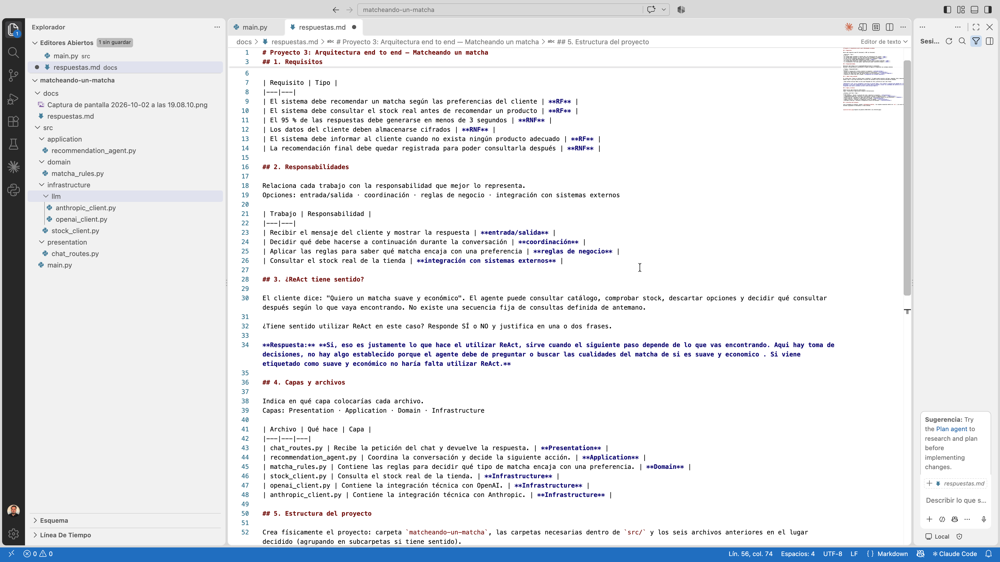
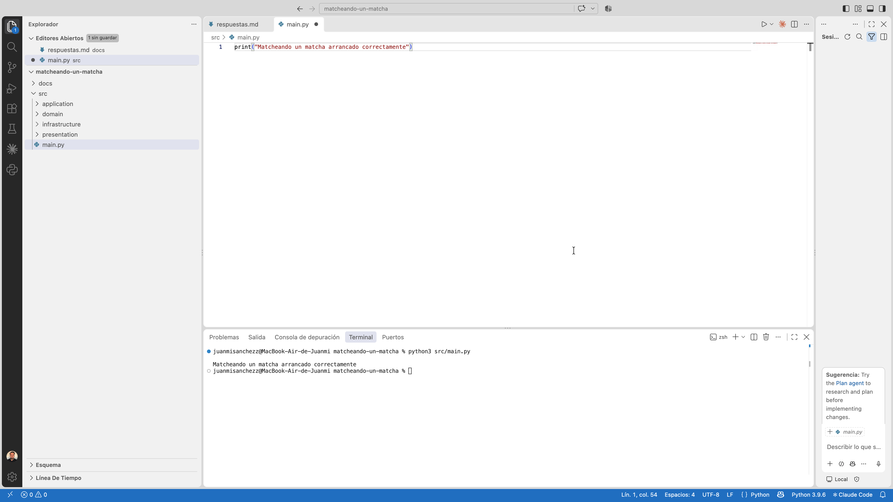

# Proyecto 3: Arquitectura end to end — Matcheando un matcha

## 1. Requisitos

Marca cada requisito como RF (funcional) o RNF (no funcional)

| Requisito | Tipo |
|---|---|
| El sistema debe recomendar un matcha según las preferencias del cliente | **RF** |
| El sistema debe consultar el stock real antes de recomendar un producto | **RF** |
| El 95 % de las respuestas debe generarse en menos de 3 segundos | **RNF** |
| Los datos del cliente deben almacenarse cifrados | **RNF** |
| El sistema debe informar al cliente cuando no exista ningún producto adecuado | **RF** |
| La recomendación final debe quedar registrada para poder consultarla después | **RNF** |

## 2. Responsabilidades

Relaciona cada trabajo con la responsabilidad que mejor lo representa.
Opciones: entrada/salida · coordinación · reglas de negocio · integración con sistemas externos

| Trabajo | Responsabilidad |
|---|---|
| Recibir el mensaje del cliente y mostrar la respuesta | **entrada/salida** |
| Decidir qué debe hacerse a continuación durante la conversación | **coordinación** |
| Aplicar las reglas para saber qué matcha encaja con una preferencia | **reglas de negocio** |
| Consultar el stock real de la tienda | **integración con sistemas externos** |

## 3. ¿ReAct tiene sentido?

El cliente dice: "Quiero un matcha suave y económico". El agente puede consultar catálogo, comprobar stock, descartar opciones y decidir qué consultar después según lo que vaya encontrando. No existe una secuencia fija de consultas definida de antemano.

¿Tiene sentido utilizar ReAct en este caso? Responde SÍ o NO y justifica en una o dos frases.

**Respuesta:** **Sí, eso es justamente lo que hace el utilizar ReAct, sirve cuando el siguiente paso depende de lo que vas encontrando. Aquí hay toma de decisiones, no hay algo establecido porque el agente debe de preguntar o buscar las cualidades del matcha de si es suave y económico. Si viene etiquetado como suave y económico no haría falta utilizar ReAct.**

## 4. Capas y archivos

Indica en qué capa colocarías cada archivo.
Capas: Presentation · Application · Domain · Infrastructure

| Archivo | Qué hace | Capa |
|---|---|---|
| chat_routes.py | Recibe la petición del chat y devuelve la respuesta. | **Presentation** |
| recommendation_agent.py | Coordina la conversación y decide la siguiente acción. | **Application** |
| matcha_rules.py | Contiene las reglas para decidir qué tipo de matcha encaja con una preferencia. | **Domain** |
| stock_client.py | Consulta el stock real de la tienda. | **Infrastructure** |
| openai_client.py | Contiene la integración técnica con OpenAI. | **Infrastructure** |
| anthropic_client.py | Contiene la integración técnica con Anthropic. | **Infrastructure** |

## 5. Estructura del proyecto

Crea físicamente el proyecto: carpeta `matcheando-un-matcha`, las carpetas necesarias dentro de `src/` y los seis archivos anteriores en el lugar decidido (agrupando en subcarpetas si tiene sentido).

